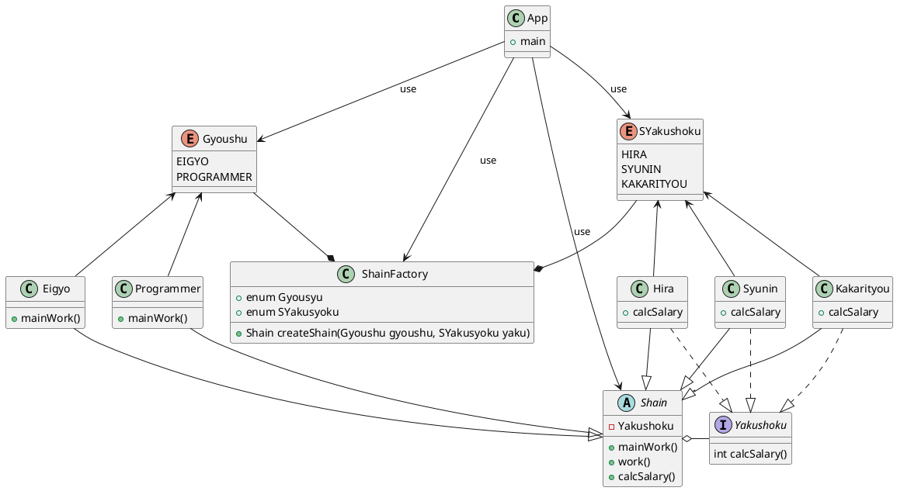
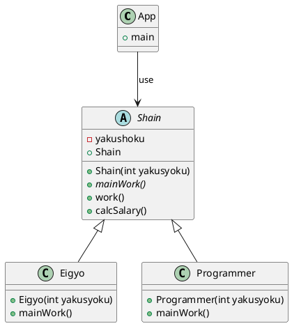
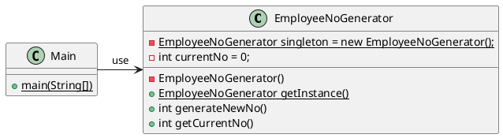

# Design pattern

- [Design pattern](#design-pattern)
  - [Factory method pattern](#factory-method-pattern)
    - [Class diagram](#class-diagram)
      - [解説](#解説)
    - [Source code](#source-code)
      - [App class](#app-class)
      - [Shain class](#shain-class)
      - [ShainFactory class](#shainfactory-class)
      - [Eigyo class](#eigyo-class)
      - [Programmer class](#programmer-class)
      - [Hira class](#hira-class)
      - [Syunin class](#syunin-class)
      - [Kakarityou class](#kakarityou-class)
  - [Template method pattern](#template-method-pattern)
    - [Class diagram](#class-diagram-1)
    - [Source code](#source-code-1)
      - [App class](#app-class-1)
      - [Shain class](#shain-class-1)
      - [Eigyo class](#eigyo-class-1)
      - [Programmer class](#programmer-class-1)
  - [Singleton pattern](#singleton-pattern)
    - [Class diagram](#class-diagram-2)
    - [Source code](#source-code-2)

## Factory method pattern

### Class diagram




#### 解説

- Appクラスは、ShainFactoryクラス、列挙型のGyoushuクラス、列挙型のSYakushoku、抽象クラスのShainクラスを使用する。

- 列挙型のGyoushuクラスは、EigyoクラスとProgrammerクラスを使用する。

- 列挙型のSYakushokuクラスは、Hiraクラス、Syuninクラス、Kakarityouクラスを使用する。

- 抽象クラスのShainクラスは、Eigyoクラス、Programmerクラス、Hiraクラス、Syuninクラス、Kakarityouクラスを継承する。

- Hiraクラス、Syuninクラス、Kakarityouクラスは、Yakushokuインターフェースを具象化する。


### Source code

#### App class

```java

public class App {

    public static void main(String[] args) {

    };

};

```

#### Shain class
  
```java

public abstract class Shain {

    private int yakusyoku;

    public Shain(Yakusyoku yakusyoku) {
        this.yakusyoku = yakusyoku;
    };

    public void mainWork() {

    };

    public void work() {

    };

    public void calcSalary(){

    };
}

```

#### ShainFactory class

```java

public class ShainFactory {

    public enum Gyoushu{
        EIGYO, PROGRAMMER;
    };

    public enum Syakusyoku {
        HIRA, SYUNIN, KAKARITYOU;
    };

    public static Shain createShain(Gyoushu gyoushu, SYakusyoku yaku) {

    }; 
    
}

```

#### Eigyo class
  
```java

public class Eigyo extends Shain {

    public Eigyo(Yakusyoku yakusyoku) {
        super(yakusyoku);
    };

    public void mainWork() {

    };
}

```

#### Programmer class

```java

public class Programmer extends Shain {
    public Programme (Yakusyoku yakusyoku) {
        super(yakusyoku);
    };

    public void mainWork() {

    };
};

```

#### Hira class

```java

public class Hira implements Yakusyoku {
    public int calcSalary() {

    };
}

```

#### Syunin class

```java

public class Syunin implements Yakusyoku {
    public int calcSalary() {

    };
}

```

#### Kakarityou class

```java

public class Kakarityou implements Yakusyoku {
    public int calcSalary() {

    };
}

```

## Template method pattern

### Class diagram




### Source code

#### App class

```java

public class App {

    public static void main(String[] args) throws Exception {
        
    }
}

```

#### Shain class
  
```java

public abstract class Shain {

    private int yakusyoku;

    public Shain(int yakusyoku) {

    }

    public Shain() {

    }

    public abstract void mainWork() {

    };

    public void work() {

    };

    public void calcSalary(){

    };
}

```

#### Eigyo class

```java

public class Eigyo extends Shain {

    public Eigyo(int yakusyoku) {

    }

    public void mainWork() {

    };
}

```

#### Programmer class

```java

public class Programmer extends Shain {

    public Programmer(int yakusyoku) {

    }

    public void mainWork() {

    };
};

```

## Singleton pattern

### Class diagram




### Source code

```java

public class EmployeeNoGenerator {
    /** 唯一のインスタンスを持つフィールド. **/
    private static EmployeeNoGenerator shingleton = new EmployeeNoGenerator();
    /** 現在の最終従業員番号. **/
    private int currentNo = 0;

    /**
     * プライベートコンストラクタ.
     */
    private EmployeeNoGenerator() {}

    /**
     * 従業員番号生成インスタンスを取得する.
     */
    public static EmployeeNoGenerator getInstance() {
        return singleton;
    }

    public int generateNewNo() {
        currentNo++;
        return currentNo;
    }

    public int getCurrentNo() {
        return currentNo;
    }
}

public class Main {
    public static void main(String[] args) {
        int kitajimaNo = EmployeeNoGenerator.getInstance().generateNewNo();
        int katoNo = EmployeeNoGenerator.getInstance().generateNewNo();
    }
}

```
